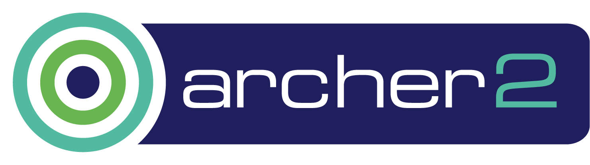

 

     

# ARCHER 2 Advanced MPI course (July 2021)

<h3>David Henty EPCC: 14 and 16 July 2021 09:30 - 17:00 BST, online</h3>

This course is aimed at programmers seeking to deepen their
understanding of MPI and explore some of its more recent and advanced
features. We cover topics including exploiting shared-memory access
from MPI programs, communicator management and neighbourhood
collectives. We also look at performance aspects such as which MPI
routines to use for scalability, MPI internal implementation issues
and overlapping communication and calculation.  Intended learning
outcomes

*  Understanding of how internal MPI implementation details affect performance
*  Techniques for overlapping communications and calculation
*  Knowledge of MPI memory models for RMA operations
*  Understanding of best practice for MPI+OpenMP programming
*  Familiarity with neighbourhood collective operations in MPI

<h3>Prerequisites</h3>

Attendees should be familiar with MPI programming in C, C++ or
Fortran, e.g. have attended the ARCHER2 MPI course.

<h3>Requirements</h3>

Participants must bring a laptop with a Mac, Linux, or Windows
operating system (not a tablet, Chromebook, etc.) that they have
administrative privileges on.

They are also required to abide by the [ARCHER2 Code of Conduct](https://www.archer2.ac.uk/about/policies/code-of-conduct.html).

<h3>Timetable (all times are in British Summer Time)</h3>

<h4>Day 1: Wednesday 14th July</h4>

 *   09:30 - 10:15 MPI Quiz
 *   10:15 - 11:00 MPI Internals
 *   11:00 - 11:30 Coffee
 *   11:30 - 13:00 Point-to-point Performance
 *   13:00 - 14:00 Lunch
 *   14:00 - 15:30 MPI Optimisations
 *   15:30 - 16:00 Coffee
 *   16:00 - 17:00 Advanced Collectives
 *   17:00 CLOSE

<h4>Day 2: Friday 16th July</h4>

 *   09:30 - 11:00 MPI + OpenMP (i)
 *   11:00 - 11:30 Coffee
 *   11:30 - 13:00 MPI + OpenMP (ii)
 *   13:00 - 14:00 Lunch
 *   14:00 - 15:30 New MPI shared-memory model
 *   15:30 - 16:00 Coffee
 *   16:00 - 17:00 Finish Exercises
 *   17:00 CLOSE

<h3>Lecture Slides</h3>

<blockquote>Unless otherwise indicated all material is Copyright
&copy; EPCC, The University of Edinburgh, and is only made available
for private study. </blockquote>

<h4>Day 1</h4>

To appear.

<h4>Day 2</h4>

To appear.

<h3>Exercise Material</h3>

<blockquote>Unless otherwise indicated all material is Copyright &copy; EPCC, The University of Edinburgh, and is only made available for private study. </blockquote>

To appear.
